<h3 align="center">Full-Stack (L1-L7) Engineer & R&D Specialist</h3>

  
  
  

---

Building at the intersection of **real-time systems**, **generative AI**, and **interactive environments**.

I specialize in low-level system programming, cross-platform audio capture, shader development for VRChat, and AI-driven pipelines. My engineering philosophy: **performance, clarity, and reliability**.

---

### Tech Stack

**Languages**

**Frameworks & Tools**

**Cloud & Infra**

**AI / Audio / XR**

---

### Featured Projects

| Project | Description |
|---------|-------------|
| **[0xBitNet](https://github.com/m96-chan/0xBitNet)** | Run BitNet b1.58 ternary LLMs with WebGPU — in browsers and native apps. |
| **[PyGPUkit](https://github.com/m96-chan/PyGPUkit)** | Minimal GPU runtime for Python — high-performance CUDA kernels, memory management, and LLM inference without heavy dependencies. |
| **[ProcessAudioTap](https://github.com/m96-chan/ProcTap)** | Cross-platform per-process audio capture (Win/macOS/Linux). Low-latency taps, real-time filters, plugin architecture. |
| **AudioLink Shader Suite** | Custom VRChat shaders reacting to audio spectra. Used in club events, DJ worlds, and visual installations. |
| **LLM Automation Pipeline** | Whisper &rarr; LLM &rarr; Slack/Discord. Diarization, summarization, topic detection, automated posting. |
| **VRChat Automation Tools** | Avatar detection, join-log analysis, OSC automation, and AudioLink-reactive effects. |

---
